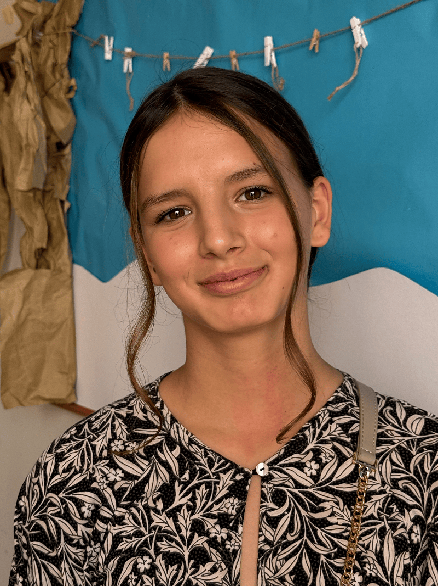

Lucjica lives with her mother in Croatia. Her mother believes in God but does not attend church regularly. But every Sabbath since she was six years old, Lucjica has gone to church with her grandmother and grandfather.

“My grandma teaches me everything about Jesus,” Lucjica says. “She shows me how to live healthy, how to choose good things to watch, how to follow God’s rules.”

Her grandmother reads from the Bible and from Ellen G. White’s books. Since she was just two years old, Lucjica has listened to Bible stories. One of her favorites is Queen Esther—the brave young woman who stood up for her people.

Lucjica has learned to be brave too.

Her favorite Bible verse is Philippians 4:13: “I can do all things through Christ who strengthens me.” She says she feels safe when she prays. She prays about school grades. She prays about problems at home. She prays when she feels unsure.

And God answers.

At church she loves Sabbath School. She is in the 5th–8th grade class. They study the Bible, pray together, and learn to forgive, to be kind, and not to judge others. “It’s very necessary,” she says. “Especially for the mental health of kids.”

She also loves Pathfinders. They meet on Sundays: sometimes at church, sometimes in the park. She enjoys camping, being outdoors, and spending time with her friends.

But one of the bravest moments of her life didn’t happen at church. It happened at school.

Lucjica is the only Seventh-day Adventist in her class. All 22 of her classmates are from another religion. One day, she was talking with her teacher about her beliefs. She explained what Adventists believe about the Sabbath, about praying directly to God, and about healthy food choices.

Instead of criticizing her, the teacher surprised her.

“Would you like to make a presentation to the class about your religion?” the teacher asked.

Lucjica agreed. She wasn’t afraid.

“God stood by me,” she says simply.

In her presentation, she explained why Adventists don’t eat pork. She showed what the Bible says about the Sabbath. She explained that Adventists don’t pray to saints but speak directly to God.

Her classmates were quiet. They listened carefully. Many of them had never heard these things before.

When she finished, her teacher gave her two “A’s” for her work.

But more important than the grades was something else: courage.

“It’s rare for young people here to know much about the Bible,” she says. “So, I want to share my beliefs with everyone.”

Lucjica knows that being different can be hard. “You don’t always have real friends at school,” she admits. “So, we learn to be brave. We [friends at church] stick together.”

Her faith is not loud or proud in a showy way. It is steady. It is grounded. It is taught by a grandmother who loves Jesus deeply—and by a God who answers prayer.

_This quarter’s Thirteenth Sabbath Offering will help rebuild the Prilaz Seventh-day Adventist Church in Croatia after it was severely damaged by an earthquake. A new church building will give children and young people like Lucjica a safe place to worship, learn, pray, and grow strong in their faith. Let’s give generously so more boys and girls can be brave for Jesus._

### Mission Record

Most people in Croatia are Christians—nearly 90 percent of the population. About 80 percent are Catholic, 3 percent are Orthodox, and about 5 percent belong to other Christian churches. A little more than 10 percent of the population say they have no religion or belong to another faith.

Croatia has 40 Seventh-day Adventist churches and 2,389 members. With a population of 3.8 million people in Croatia, that means there is one Adventist for every 1,612 people in the country.

Adventist publishing work in Croatia began in 1913 but was interrupted during the communist regime. However, it began again in the early 1990s and continues today.

```=Story Tips

- Show the continent of Europe on a map, pointing out the country of Croatia. Then show the capital city of Zagreb, where part of this quarter’s offering will go to help rebuild the church that was severely damaged by an earthquake.
- Watch short videos and download photos at https://facebook.com/missionquarterlies
- For children’s Bible studies, resources, and more, visit: children.adventist.org

```