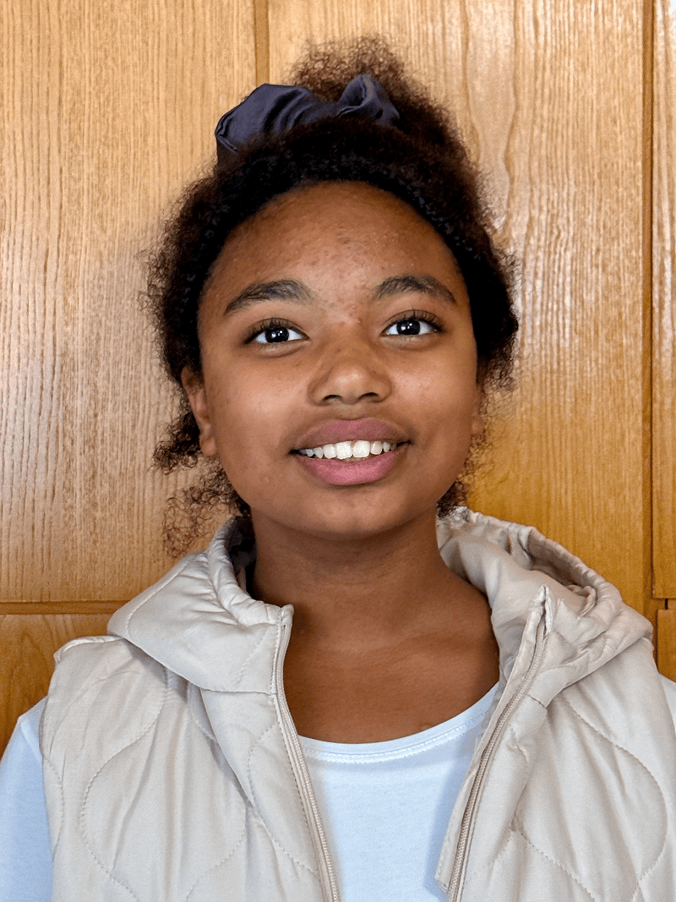
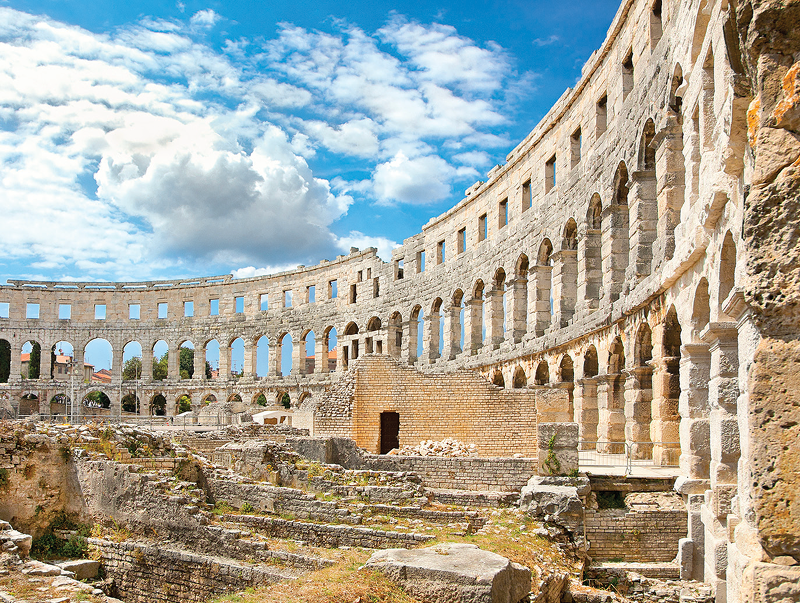

Nana is 12 years old and in sixth grade. She lives in Croatia and loves art, English, and German. She also loves Jesus.

One afternoon, Nana was reading messages in her class chat group. It was a chat for parents about students called “Our Students.” A mother had written an urgent message:

“Tomorrow the children must bring a Bible to religion class. But we don’t have one.”

In Croatia, most religion classes in public schools are organized by the Catholic Church. Many families don’t own a Bible at home. They just learn what their priest tells them.

When Nana saw the message, she ran to her mother.

“Mama! They need Bibles!”

Her mother knew a friend who had received a donation of Bibles from Germany.

“Maybe we could share some,” she said.

Without hesitating, Nana sent a message in the class group on behalf of her mother:

“We can provide a Bible for each student in the class.”

Very quickly, about twelve mothers replied: “Yes! We would like one.”

Then Nana added another message: “Mothers can have one too.”

The answer was yes again.

That afternoon, Nana and her mother borrowed a suitcase and went to collect the Bibles. They filled it until it was heavy. Another mother helped transport the suitcase to the school because Nana’s family didn’t have a car.

The next morning, Nana stood outside the school building with her classmates. One by one, students came to receive their own Bible. In total, 42 Bibles were distributed—about 30 for students and 12 for families.

The religion teacher, a Catholic nun, saw the Bibles and said, “These are very good Bibles. Can you bring more?”

Soon, more Bibles were placed in the classrooms for grades five through eight. One classmate even put her Bible on her desk in English class and said proudly, “Here is my Bible with the rest of my books.”

The students were amazed the Bibles were free. In local shops, a Bible can cost about 50 euros. Now they could read God’s Word for themselves.

But the story didn’t end there.

At the end of the school year, Nana noticed something different about one of the boys in her class. He used to curse and fight often. Now he was calmer. He had stopped swearing. Sometimes he even prayed in the classroom.

One day he mentioned to his friends that he was reading the Bible.

Nana smiled quietly. She remembered the suitcase.

Another girl in her class used to swear a lot. Nana gently told her, “We believe in Jesus. When you use His name that way, it hurts Him.”

The girl began to think about it. Nana prayed with her. Over time, she stopped cursing too.

Why did Nana do all this?

“I want to share Jesus’ love,” she says. “Some of them are thirsty in their hearts.”

Nana knows she is just one small part of a bigger story. The Bibles were donated by believers in Germany. A friend in Croatia helped distribute them. And Nana carried the suitcase.

But sometimes God uses a 12-year-old girl to start something big.

And it all began with one message on a phone—and a heart willing to say yes.

_Your Thirteenth Sabbath mission offering this quarter will help to rebuild a church in Zagreb, Croatia, that was destroyed by an earthquake. It will provide a place for children like Nana to grow their faith as they attend Sabbath School, Pathfinders, and other faith-building activities._

### Amazing Country

One of Croatia’s most famous landmarks is the Pula Arena. Located in the city of Pula, this ancient Roman amphitheater was built nearly 2,000 years ago. It is the only remaining Roman amphitheater in the world with its entire circular outer wall still standing.



```=Story Tips

- Show the continent of Europe on a map, pointing out the country of Croatia. Then show the capital city of Zagreb, where part of this quarter’s offering will go to help rebuild the church that was destroyed by an earthquake.
- Watch short videos and download photos at https://facebook.com/missionquarterlies
- Encourage the children to take turns learning and telling the mission story in Sabbath School.

```