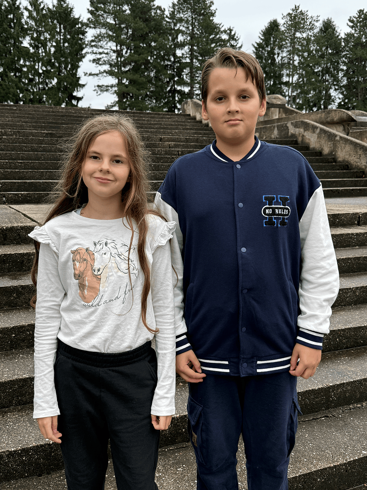
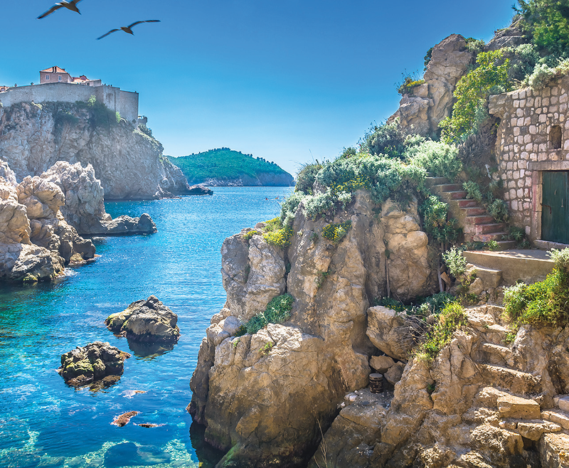

Teodor, 12, and his sister, Anastasia, 10 have lived in many places.

They were born in Croatia. They lived in Maruševec, then Zagreb. For a time they even lived in England while their father studied. Then they moved again. And again.

Why so many moves?

Because their dad is a pastor.

Being a pastor’s kid—a “PK”—is sometimes exciting. And sometimes it’s tiring.

“Sometimes it’s fun to travel,” Teodor says. “But sometimes we need to wake up very early.”

“It’s a little bit hard,” Anastasia adds. “We are in the car a lot.”

Their father preaches in different churches around Croatia and even near the Austrian border. Wherever he goes, the children often go with him.

And they don’t just sit quietly in the pew.

They help.

“We sing,” Teodor says. “We collect the offering. We pray during the service.”

They’ve been singing in church since they were five and seven years old. Now they even sing in the adult choir, even though there aren’t many other children in it.

At home, faith is part of everyday life.

Every evening, the family studies the Bible together. They read a chapter, talk about what it means, and then each person prays. Right now, they are reading about Moses leading God’s people through the desert.

“We ask what we can learn from it,” Anastasia explains.

They also attend Pathfinders. They’ve participated in Bible competitions and even traveled to Budapest for the Pathfinder Bible Experience. They love Bible camp: making friends, playing games, and learning more about God.

But not everything is easy.

In public school, sometimes other children tease them because they are Adventists.

“They didn’t like that I was Adventist,” Teodor says quietly.

Anastasia was teased too.

“I ignored it,” she says. “I had good friends.”

Living in a country without Adventist elementary schools means they attend public schools. They stand out sometimes. Their beliefs are different.

But instead of hiding their faith, they live it.

They help their dad. They sing about Jesus. They serve in church. They study the Bible. They pray.

And they keep going.

Being a pastor’s kid means more than traveling and singing. It means learning that church is not just a building—it’s people. It’s service. It’s family.

And when church buildings are damaged, like the Prilaz church in Zagreb that was severely damaged in the earthquake, children still need a place to gather, sing, pray, and grow.

_Our Thirteenth Sabbath Offering will help rebuild the Prilaz church in Croatia. A new church building will give children a safe place to worship, sing in choirs, study the Bible, and make friends who love Jesus._\
_Let’s give so more boys and girls can grow up strong in faith._

### Amazing Country

The official name of Croatia is the Republic of Croatia, and the people who live there speak Croatian. The name “Croatia” comes from an ancient word that means “guardian” or “protector.”

Croatia is a country full of natural beauty. Along its western coast are more than a thousand islands scattered across the sparkling Adriatic sea. In the eastern part of the country, the mighty Danube River—Europe’s second-longest river—flows past the city of Vukovar.



```=Story Tips

- Show the continent of Europe on a map, pointing out the country of Croatia. Then show the capital city of Zagreb, where part of this quarter’s offering will go to help rebuild the church that was severely damaged by an earthquake.
- Watch short videos and download photos at https://facebook.com/missionquarterlies
- Ask the children how they would share Jesus with children who do not know Him yet.

```