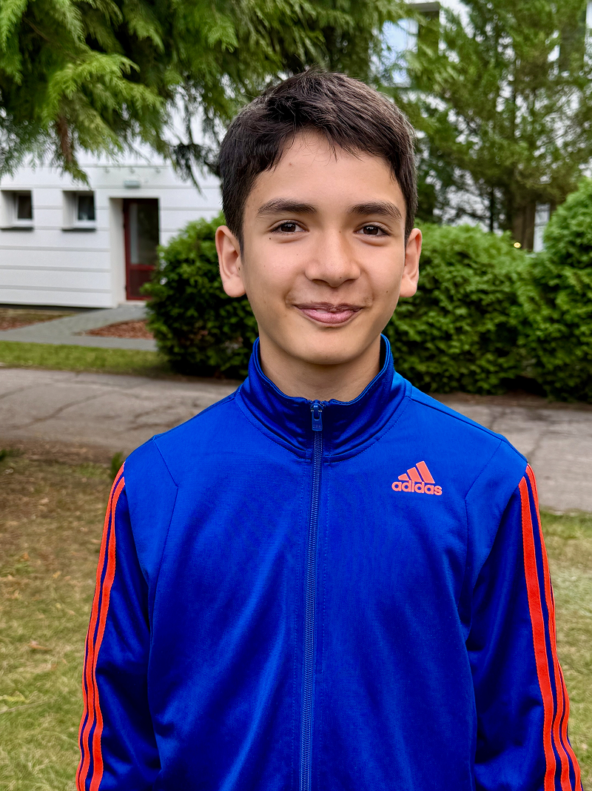

Filip remembers what it felt like when his parents did not live together.

“I stayed with my dad,” he said. “I saw my mom on weekends—sometimes.”

He was still a boy when it happened. But he knew what to do.

“I prayed,” Filip said.

He kept praying for five years.

Before that, he had heard many sermons at church. His mother had taught him that God listens. So even when things felt confusing and sad, Filip kept going to Sabbath School. He kept praying.

And then something changed.

“My parents are back together now,” he said quietly. “It has been three or four years.”

Filip believes God answered his prayer. And even though sometimes God doesn’t answer in just the way we would like, we know that in the end we can always trust Him to do what is best.

Today Filip is in grade 8 at the KOMPAS Adventist Primary School in Poland. But getting there was another answer to prayer.

He did not always attend this school. For a time, he went to a public school near his home. His mother hoped he could attend the Adventist school, but it was a 40-minute drive each way. His father was not sure at first.

“I prayed about it for one year,” Filip said.

Then his father agreed.

Now Filip has been at KOMPAS since grade 6.

What does he like most?

“P.E.,” he said quickly. “Football and volleyball.”

He also likes the hot lunches.

But when he compares this school to public school, he becomes more thoughtful.

“In public school there were more students, so there were more friends,” he explained. “But here the teachers are more kind. They are more passionate about their work.”

He says people are nicer.

“There isn’t swearing,” he added. “And everyone is generally kinder.”

Filip especially notices the spiritual atmosphere.

Every morning the class gathers for Bible time. They sit in a circle and talk about Scripture. Sometimes they discuss stories about heaven and the great controversy.

“It was sad,” he said, remembering one lesson, “that Satan was first so good and powerful and then he turned so bad.”

The Bible stories feel real to him.

When he attended public school, faith was something he mostly experienced at church. Here, it is part of every day.

His mother has noticed the difference.

“After one year at KOMPAS, his prayers became more mature,” she said. “He began praying about things he never prayed about before.”

Once, Filip had a very high fever—41 degrees Celsius (105.8°F). Many children would be happy to stay home from school.

But not Filip.

“He still wanted to go,” his mother said with a smile.

The family lives 35 kilometers (about 22 miles) from the school. Each day, Filip’s father drives him to campus in the morning, waits while working on his computer, and drives him home in the afternoon.

It takes time. It takes effort. It takes sacrifice.

But for Filip, it is worth it.

When asked what he hopes to do in the future, he thinks for a moment.

“Maybe something useful,” he said. “And maybe I could travel.”

He has already learned something important: prayer matters.

_Today, many more children want to attend KOMPAS. More families are choosing_\
_But there is a problem—the school is running out of space._\
_That is why part of this Thirteenth Sabbath Offering will help expand the classroom space at KOMPAS Adventist School in Poland._\
_Your offering will help build more room for children to learn about Jesus. It will help create space for more circles of students opening their Bibles each morning. It will help more boys and girls grow in faith, just like Filip._\
_When you give this Thirteenth Sabbath, you are not just building classrooms. You are helping to build faith. Thank you for giving generously.__

### Mission Record

Poland has a population of about 37 million people. Among them are 6,032 Seventh-day Adventists who worship in 117 churches and 33 companies. That means there is one Adventist for every 6,228 people in Poland. The first Adventist missionaries came to Poland from Crimea. In 1893, the first Adventist church was started. During World War II, churches were closed, but in 1946, after the war ended, the churches were allowed to open again.

```=Story Tips

- Show the continent of Europe on a map, pointing out the country of Poland. Then point out the capital city of Warsaw and explain that the KOMPAS school is in the village of Podkowa Lesna, about 40 kilometers (24.8 miles) southwest of Warsaw.
- Watch short videos and download photos at https://facebook.com/missionquarterlies
- Read more about how the school began at: https://bit.ly/AdventistPrimarySchoolPoland this special place where students pray together, study the Bible each morning, and learn in a kind and caring environment.

```