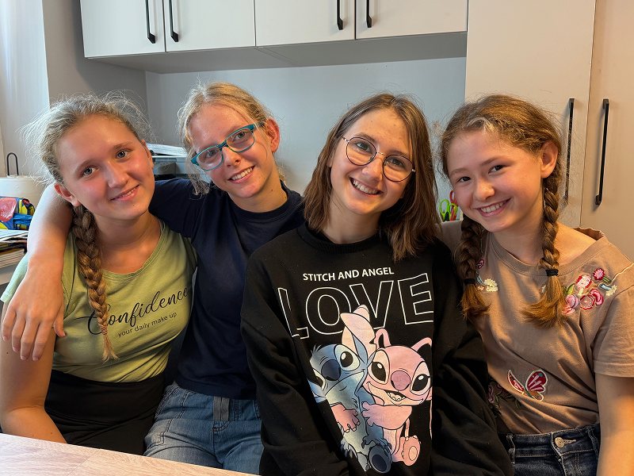

When Lilianna (second from left in picture) went to Sabbath School one morning, she didn’t expect to be given money.

Her teacher handed out small amounts to several students. “You can keep this,” he said, “or you can try to multiply it and use it for something good.”

Lilianna looked at the coins in her hand. She thought about the lesson they had just studied—about helping others instead of focusing only on yourself.

She didn’t want to keep it.

Neither did her friend. Neither did her sister.

Instead, they made a plan.

They used the money to buy ingredients. Soon they were baking cookies and waffles and making lemonade. At school, they set up a small table to sell their treats. There was a long line of people waiting—including some university students who were visiting campus.

By the end of the day, they had raised almost ten times the amount they had started with!

But they didn’t stop there.

The girls had heard about an orphanage school in Tanzania that had burned down. The children there needed help rebuilding. So, the money they raised was sent to support that project.

Another time, the girls learned about a young girl named Prisca. Prisca is from Tanzania and she has “albinism”—an inborn condition where the body does not make enough color (pigment). This usually makes a person’s hair, skin, and eyes very light. It is something they are born with, not something they can catch, and it can cause their skin and eyes to be extra sensitive to the sun.

Because of prejudice in her community, Prisca was having a very difficult life and needed help to continue school.

Again, the students at KOMPAS wanted to help.

They made handicrafts—bookmarks and small items—and went to the local train station to sell them. They also sold flowers near Mother’s Day and told people what the money was for. They handed out leaflets explaining the project and made sure everyone knew that 100 percent of the money would go to help Prisca.

Even the younger children joined in. They walked nearly two kilometers into town to collect money. They even visited the police station! The officers were so happy to see them that they donated money and gave the children lollipops.

“We also gave out free popcorn,” Lilianna said. “We told people to have a good day.”

The girls wear their school T-shirts when they go out. They want people to know they are from a Christian school. Every day, school begins with worship and Bible study. They learn that loving God means helping others.

Gabriela says she likes the school because “it’s a happy place.” Melisa says she loves starting each day with Bible study. Miriam remembers being the only girl in her class when the school first started and praying for another girl to join her. God answered her prayer when Melisa came the next year.

At KOMPAS, the students don’t just learn math and languages. They learn how to care.

Your Thirteenth Sabbath Offering will help this school in Poland continue to grow. As the school expands, more children will learn how to serve, pray, and help others—just like these girls did.

You may not have much—but when you give it to God, He can multiply it too.

### Amazing Country

In the Polish language, the country of Poland is called Polska, which means “field” or “flat land.” In the north, Poland has beautiful beaches along the Baltic Sea! People in Poland speak Polish, and they use money called złoty. Poland has around 10,000 lakes! The largest lakes are Śniardwy and Mamry, and the deepest is Lake Hańcza, which is about 356 feet (108.5 meters) deep—almost as tall as a 30-story building!

```=Story Tips

- Show the continent of Europe on a map, pointing out the country of Poland. Then point out the capital city of Warsaw and explain that the KOMPAS school is in the village of Podkowa Leśna, about 40 kilometers (24.8 miles) southwest of Warsaw.
- Watch short videos and download photos at https://facebook.com/missionquarterlies
- Read more about how the school began at: https://bit.ly/AdventistPrimarySchoolPoland And they are discovering something important: when you give what you have to God, He multiplies it.

```