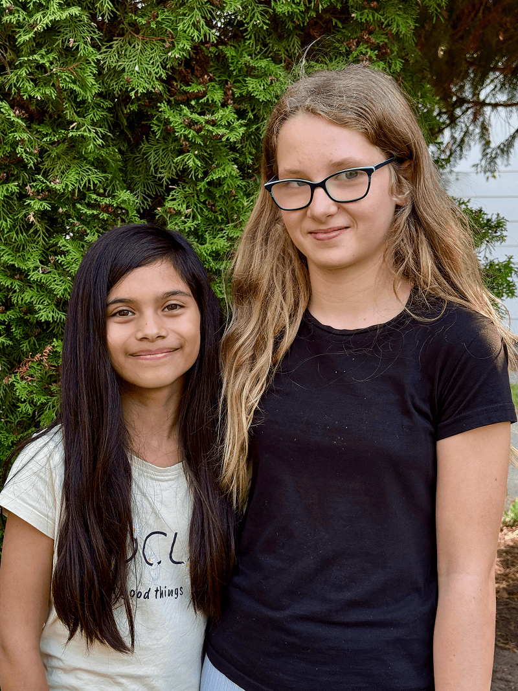
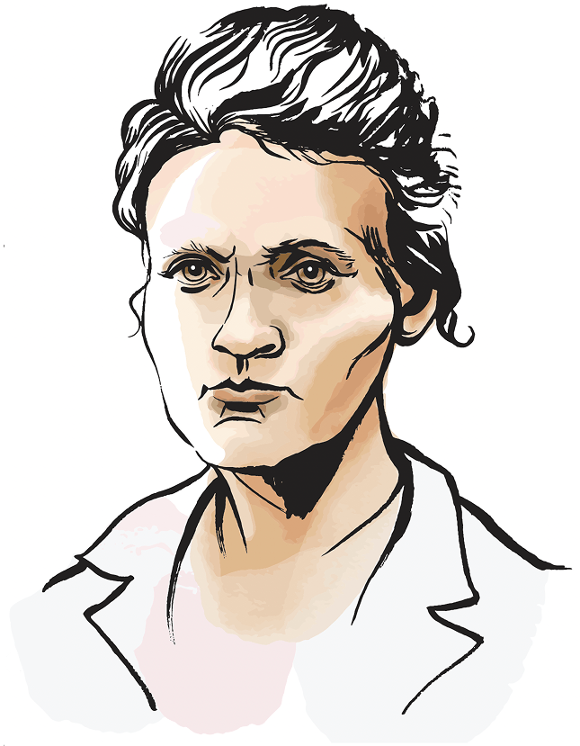

Polianna had a very specific prayer: she wanted a best friend.

When her family moved to England for a few years, everything felt new and unfamiliar. At first, she cried almost every day at school. It was hard to adjust.

Eventually she found a school she liked, but deep down she still longed for something special—a best friend.

Later, when her family moved back to Poland, Polianna prayed again.

“I wanted a best friend,” she says. “So, I prayed about it.”

Hanna had been at the Adventist school since preschool. She liked history, art, and IT. She already had friends, but not a “best, best friend.”

The two girls had known each other when they were younger, before Polianna moved away. But when Polianna returned to Poland and joined the school in third grade, something changed.

“We became best friends,” Hana says simply.

Polianna smiles. “I prayed,” she says.

But that wasn’t the only prayer God answered.

Polianna also wanted a little sibling. She already had an older sister, but she hoped for a baby in the family.

Her mother told her it wasn’t possible. But then she added, “You can pray.”

So Polianna did.

For months she prayed quietly. Then one day, she overheard her parents talking. Her mother had gone to the doctor for something else—and discovered she was expecting a baby.

“When I found out, I cried for happiness,” Polianna says. “I couldn’t sleep!”

At school, the girls are learning that prayer isn’t only about what we want—it’s also about helping others.

When a preschool mother suddenly became very sick with cancer, the students wanted to help. She had three small children, including two-year-old twins. The news shocked everyone.

So, the school organized a charity event. The students sewed crafts, baked food, and created a café. They served as waitresses.

They raised money to help support the family and the mother’s treatment.

Another time, they helped a girl named Prisca in Tanzania. Prisca is albino and faces prejudice in her community. She wanted to continue her studies but did not have enough money.

The students baked, made bookmarks, and wrote letters to her so she would feel encouraged. Prisca wrote back.

At this Adventist school, every day begins with worship. The students learn about Jesus, and they also learn how to care.

Hana likes that they can learn many subjects—history, art, IT, science, and sports. Polianna loves basketball and running around campus.

But perhaps the most important lesson they are learning is this: God listens.

He listens when a girl prays for a best friend.

He listens when a child prays for a baby sibling.

And He listens when children pray for people on the other side of the world.

_Today, your Thirteenth Sabbath Offering will help this Adventist school in Poland grow so more children can learn to pray, serve, and care for others._

### Amazing Country

Poland has given the world some very important scientists! Nicolaus Copernicus (1473-1543) carefully studied the sky and showed that the sun—not the Earth—is at the center of our solar system. This was a bold and surprising discovery in his time! More than 300 years later, Marie Curie (1867–1934)—whose Polish name was Maria Skłodowska-Curie—became a pioneer in studying radioactivity. She was the first woman to win a Nobel Prize and the first person in history to win two Nobel Prizes. These Polish scientists helped people better understand God’s amazing universe and the tiny building blocks of matter.



```=Story Tips

- Show the continent of Europe on a map, pointing out the country of Poland. Then point out the capital city of Warsaw and explain that the KOMPAS school is in the village of Podkowa Leśna, about 40 kilometers (24.8 miles) southwest of Warsaw.
- Watch short videos and download photos at https://facebook.com/missionquarterlies
- Read more about how the school began at: https://bit.ly/AdventistPrimarySchoolPoland

```