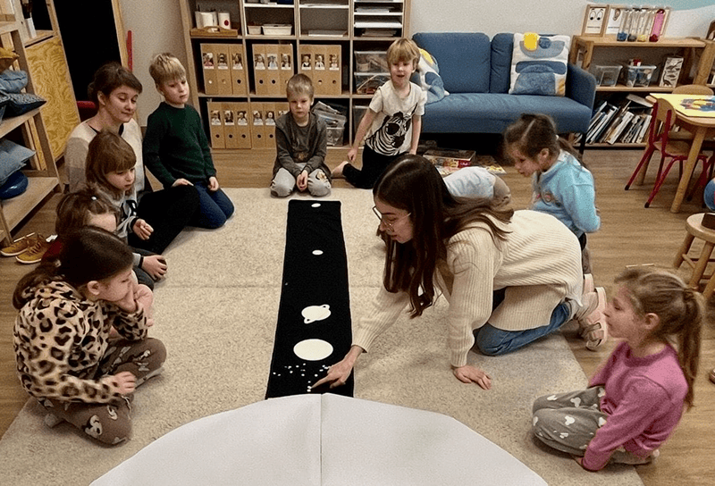
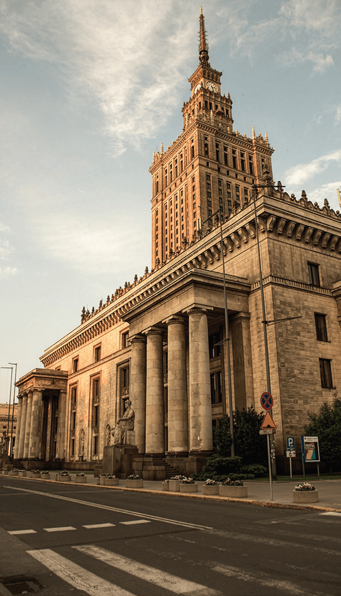

Five-year-old John had a question every morning.

“Can we read from the big Bible today?” he would ask.

At the KOMPAS kindergarten in Poland, the children usually listened to stories from a children’s Bible. But John wanted something different. He wanted the real Bible—the one adults read.

Some of the words were long. Some were hard to understand. But John didn’t mind.

One day, he brought his mother into the classroom. “Can you take a picture of this Bible?” he asked her. He wanted one just like it at home.

John loved learning about God.

Not every child at his school comes from an Adventist family. Some families believe differently. Some parents even ask that their children not attend Bible time.

That happened to one five-year-old boy.

While the other children gathered for Bible stories and songs, he stayed in another room. But sometimes, during Bible time, the teachers could hear him in the hallway, singing loudly:

“The Lord is coming!”

One day he told his teacher that God wasn’t real, because that is what his parents had said. But another day, he shared something different.

He had prayed for his cousin, who lived far away. He missed her very much. A few days later, she came to Poland for a visit.

“He answered my prayer,” the boy said.

Later, he asked his parents if he could join Bible time. The teachers called home and talked with them. After thinking about it, his parents said, “If you want to go, you may.”

He chose Bible class.

Another child, a six-year-old girl, loved to pray for her teachers.

One teacher at the school had been praying for a baby for a long time. It made her sad to wait.

During prayer time one day, the little girl knelt down and prayed, “Dear God, please give Auntie Katya a big belly!” The children smiled. The teacher smiled, too.

The girl kept praying that same prayer every week.

Three months later, the teacher found out she was going to have a baby.

When she told the class, the little girl who had prayed so faithfully was the first to bring a gift for the baby.

At this Adventist school in Poland, children learn more than reading and numbers. They learn that God hears prayers. They learn that the Bible is important. They learn to choose for themselves.

Sometimes they choose the “big Bible.” Sometimes they choose to join Bible time. Sometimes they choose to pray for someone they love.

And God listens.

_Your Thirteenth Sabbath Offering will help this school grow so more children can learn about Jesus every day—and discover that He listens to them too. Thank you for giving generously!_

### Amazing Country

During World War II, the city of Warsaw was almost completely destroyed by bombs. But after the war, the Polish people carefully rebuilt their city using detailed eighteenth-century paintings made by a Venetian artist named Bernardo Bellotto. Because of those paintings, Warsaw’s beautiful old buildings could be restored just as they had looked long ago. One famous building in the city today is the Palace of Culture and Science. Inside, you can find conference rooms, sports arenas, movie theaters, and even a swimming pool! And animals live there! Cats patrol the lower floors to keep away mice, falcons nest high up on the 42nd floor, and on the sixth floor there is a giant apiary filled with busy bees.



```=Story Tips

- Show the continent of Europe on a map, pointing out the country of Poland. Then point out the capital city of Warsaw and explain that the KOMPAS school is in the village of Podkowa Leśna, about 40 kilometers (24.8 miles) southwest of Warsaw.
- Watch short videos and download photos at https://facebook.com/missionquarterlies
- Read more about how the school began at: https://bit.ly/AdventistPrimarySchoolPoland

```