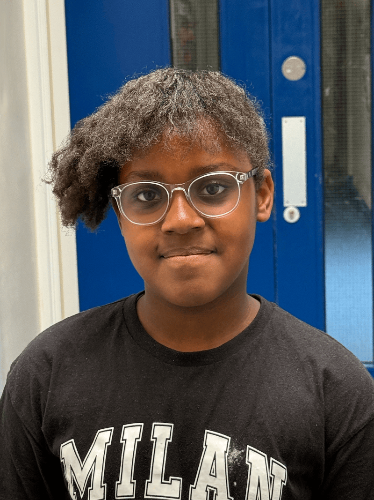

When Amarissa was four years old, she began learning the piano during playtime at school.

“At first I just thought it sounded nice,” she said with a smile. “And I like moving my fingers around a lot!”

Her mother wanted her to learn an instrument early. “Piano is a good foundation,” she explained. “And when the tutor came into the school, we thought it was a great opportunity.”

Not long after, Amarissa also fell in love with the violin.

“I really liked the sound,” she said. “And I still enjoy it.”

Today, Amarissa is nine years old and plays both piano and violin at the East London School of Classical Music (ELSOM). She has already earned piano exam qualifications with distinction. She also plays in the orchestra and has performed in a large ensemble in London.

“It was exciting and fun,” she said. “I didn’t have stage fright because I’ve played in church before. Even if I made mistakes, it was OK because there were lots of people playing.”

One of her favorite violin pieces is the hymn, “Be Thou My Vision.”

“I love the hymns,” she said.

At ELSOM, music theory is part of every student’s training. Amarissa studies how music works—not just how to play it.

“Sometimes they tell you to play something you haven’t done before,” she explained. “It looks hard, but then it becomes easier.”

Her mother appreciates that balance. “They don’t just teach children to press the right keys,” she said. “They teach them to understand what they’re playing. And older students help younger ones. It gives the children something to aspire to.”

For Amarissa, being part of the orchestra has been especially meaningful.

“When I play with lots of other people, it makes me feel happy,” she said. “And I like learning new things.”

She also plays for school assemblies and church programs. Performing sacred music has helped her feel confident.

“The songs we play praise the Lord,” she said simply.

Her family is not Adventist, but they chose the Adventist school because of its values. Amarissa’s mother grew up attending Adventist camps in Jamaica and appreciated the strong moral foundation she saw.

“We sacrifice to make this possible,” her mother said. “But we haven’t been disappointed. The opportunities are endless.”

Now Amarissa has big dreams.

One day, she hopes to become a music teacher—just like some of the older students she admires. She loves seeing how they guide younger musicians.

“I want to help others learn,” she said.

From tiny fingers pressing piano keys at age four to playing hymns in an orchestra, Amarissa’s journey is still just beginning. Through music, she is learning discipline, confidence, and faith.

And she is discovering that when you practice faithfully, even something that looks difficult can become beautiful.

At ELSOM, children from many different backgrounds come together to learn music. They play instruments, sing together, and discover talents they may not have known they had. Through music they make new friends and grow in confidence. ELSOM shows how music can bring joy and hope to a whole community.

_This quarter’s Thirteenth Sabbath Offering will help create Safe Space2Be—special caring places inside community schools. In these spaces, children can talk with someone they trust, take part in art or music activities, and find encouragement when they need it. Families will also be welcome to come and receive help and support._\
_Just like ELSOM uses music to bless its community, Safe Space2Be will help schools become places of kindness, healing, and hope. Your offering will help children know they are valued, cared for, and never alone._

### Mission Record

The United Kingdom (UK) is home to nearly 75 million people. Today, it is part of the British Union Conference, which has 312 Seventh-day Adventist churches, 113 companies, and 44,670 members—that’s about one Adventist for every 1,678 people. The first Seventh-day Adventist missionaries to Britain were John N. Loughborough and his wife, Annie, who arrived in Southampton in 1878. Even though the work was slow at first, 100 people were baptized before they returned to America in 1883. By 1903, the British Union Conference was officially organized. Today, there are seven Adventist schools in Britain, helping children learn about Jesus while they study and grow.

```=Story Tips

- Show the United Kingdom on a map, pointing out the area of England. Then show the capital city of London, where the East London School of Music (ELSOM) is located.
- Explain that part of the Thirteenth Sabbath Offering will help children across England who are struggling to have safe spaces in schools where they can talk with someone who cares and can offer help.
- Watch short videos and download photos at https://facebook.com/missionquarterlies

```