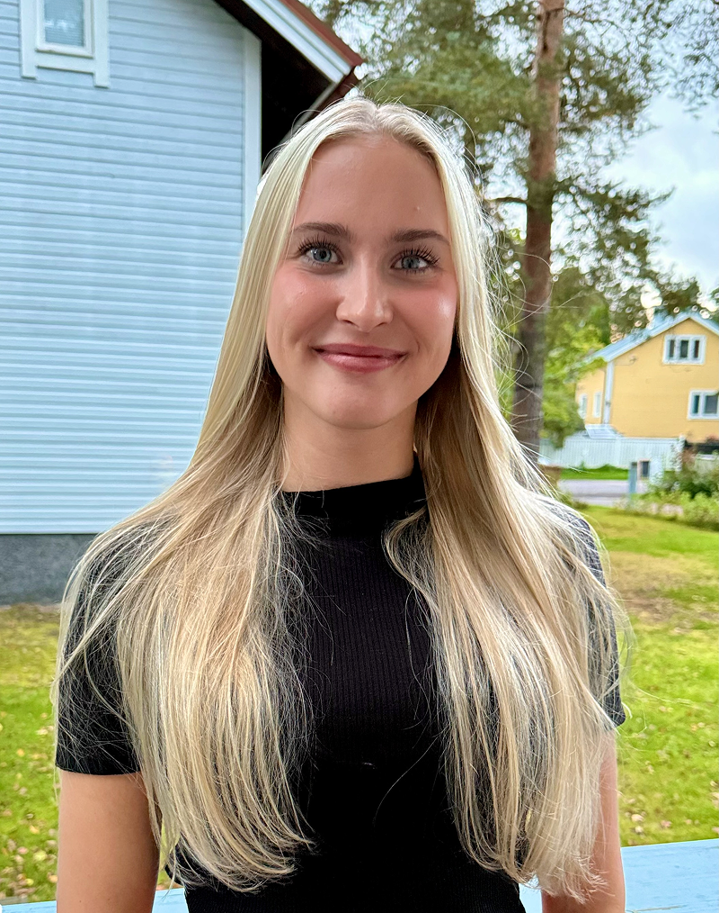

Jenny wasn’t looking for a church that winter day in Helsinki’s city center—she was praying for friends.

Only three months earlier, she had begun a personal journey of faith. While waiting for her mother at a doctor’s appointment, Jenny wandered through the streets, quietly asking God for Christian community. Almost immediately, she felt impressed to walk down a particular street near a busy square.

That decision changed everything.

There, she met a small group from OIKOS House, a Seventh-day Adventist church plant in Helsinki. One of the outreach volunteers approached her with an unexpected question: “Has anyone ever written a poem for you?” When she said no, he asked her to share three words. One of them was “peace.”

As they talked, Jenny admitted she believed in God, but she didn’t yet realize the group was Christian. When they explained they were inviting people to church, another volunteer, Linda, shared about OIKOS House. Contact information was exchanged, and a simple invitation followed.

At first, Jenny hesitated. But she trusted the same God who had led her down that street. “I wasn’t afraid,” she later said. “I knew this was from Him.”

Two weeks later, she rang the doorbell of the OIKOS House.

“I was expecting a church building,” Jenny recalled with a smile. “I thought, What if there’s just a family having dinner inside? But I prayed, ‘Lord, You led me here—so keep leading me.’”

She was welcomed warmly. Worship flowed naturally into small-group conversations, and strangers quickly became friends. “It felt like family right away,” she said. “So, I just kept coming.”

Jenny grew up with a mixed religious background, with her parents coming from two different religions. But going to church was never a consistent part of her life. As a young adult, she lived a secular lifestyle and found herself in a painful relationship that left her emotionally broken.

“I was miserable and searching for something to hold onto,” she said. “I knew about God, and that was my last hope.” In desperation she prayer, “If You are really there, please help me.”

God answered.

As Jenny began forming a personal relationship with Jesus, she found the strength to leave the relationship and her old way of life behind. In prayer, God also did something she never thought possible—He removed her anger and bitterness.

“I realized I didn’t hate him [the boyfriend who had cheated on her] anymore,” she said. “And I told him that Jesus had taken the anger away.” Through forgiveness, Jenny was able to share the gospel with her former boyfriend—something she says she could never have done on her own.

After stepping away from her old life, Jenny experienced a quiet season of growth—time with God, her family, and prayer for new friends. Those prayers were answered through OIKOS House.

“What I love most about OIKOS is that it’s family,” she said. “Everyone is welcome as they are. People from so many backgrounds—and it just works.”

Through that community, Jenny met Timi, who had been part of the original OIKOS core team. Their friendship grew into a relationship rooted in faith, prayer, and purpose. After nine months of dating, they became engaged during the ARISE discipleship program and were married in July 2025.

Jenny also participated in ARISE Finland, a three-month discipleship and outreach program held in eastern Finland. There, Bible study, community living, and hands-on outreach deepened her faith.

“The most important thing I learned,” she said, “was that God is love. When you see that, the whole Bible comes together.”

Today, Jenny is studying early childhood education at the University of Helsinki, preparing for a future of service. She and Timi live near OIKOS House, just minutes from where she first rang the doorbell.

Looking back, Jenny sees God’s hand clearly: from a simple prayer on a city street to a spiritual family, a restored life, and a heart ready for mission.

“I didn’t connect the dots at first,” she said. “But now I see—God was leading me the whole way.”

_Across Finland, many young adults, like Jenny, are searching for community, purpose, and a place where faith feels personal and lived. Part of this quarter’s Thirteenth Sabbath Offering will help OIKOS House expand that ministry by launching a new church plant designed especially for families. Just as a simple invitation on a Helsinki street led Jenny to spiritual family and new life in Christ, your mission offerings help create spaces where others can encounter God, find belonging, and begin their own journey of faith. Thank you for praying for church plants and for your generous mission offerings._

```=Story Tips

- Show the location of Helsinki, Finland on a map.
- Download photos for this story from Facebook: https://bit.ly/fb-mq.
- Share facts related to Finland (see below)

```

```=Mission Post

- The first Seventh-day Adventist in Finland was a sea captain—A. F. Lundqvist, who, while docked at Liverpool, England in 1885, bought Uriah Smith’s Daniel and the Revelation and Ellen White’s The Great Controversy from a colporteur. He remained a faithful church member until his death in 1955, aged 97.
- The first Church worker in Finland was a Swedish canvassing leader, Emil Lind, who was sent to Finland in 1891. He found the work difficult and was even threatened with exile to Siberia.
- In 1892, the Swedish Conference president, Olof Johnson, and two Bible workers, Augusta Larsson and Matilda Lindgren, came to Helsinki. Because foreigners could not hold public meetings, Johnson held them in his own home.

```