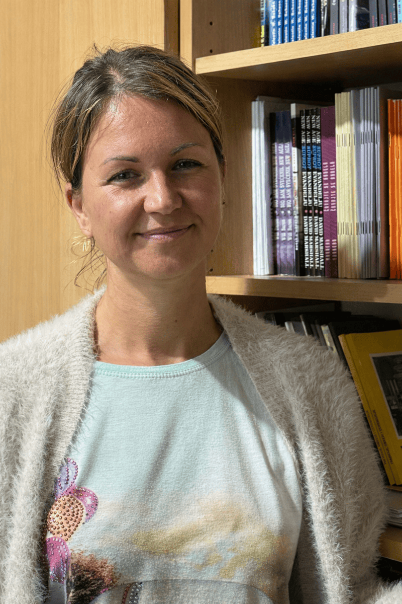

On weekday afternoons in Zagreb, laughter and quiet concentration fill a church library known as the “Prilaz School.” At one table sits Nika, patiently helping a child work through a difficult assignment. At another moment, she pauses and asks gently, “Shall we pray?”

For up to twelve students each week, Nika is more than a tutor. She is a steady presence—someone who listens, encourages, and points young hearts toward God.

One day a student’s mother was hospitalized unexpectedly. The children were worried. “Let’s pray for her,” Nika suggested. They did. Soon afterward, the mother recovered.

Another child, so happy in the warm atmosphere of the program, once declared, “I want to work here when I grow up!”

For Nika, moments like these are deeply meaningful. “I feel very fulfilled and very close to Jesus,” she says. “I know the Holy Spirit is leading me.”

But only a few years ago, her life looked very different.

Like most people in Croatia, Nika was raised in the country’s traditional religion. As a young adult, however, she began searching for something more. Her spiritual curiosity led her into New Age teachings. She even traveled to India, exploring ideas about reincarnation and participating in elaborate rituals.

“But it was empty,” she recalls. “Nothing changed. I prayed, but everything stayed the same.”

What troubled her most was the inconsistency. “They talked about good things,” she says, “but they were not living them.”

Disillusioned and spiritually restless, Nika returned to Croatia feeling alone and without purpose. Then one day, she met an older woman who invited her to church.

There she received a Bible.

As she began reading, something caught her attention—the Sabbath. It seemed clear in Scripture.

“Why don’t you go to church on Saturday?” she asked the pastor.

“It’s not important,” he answered. “It’s only a day.”

But Nika could not ignore what she was discovering.

“It’s not only a day,” she thought.

She began praying: “Show me the truth.”

While searching online, Nika came across a YouTube channel addressing topics she had once wrestled with—reincarnation, creation, and the reliability of Scripture. The presentations made sense. She learned the speaker was a Seventh-day Adventist and would soon be lecturing at a local Adventist church. She decided to attend.

Again, what she heard resonated deeply.

Even more, the people welcomed her warmly—especially Mileta, the church librarian, who asked if she would like to enroll in the Discovery Bible Correspondence School.

“I’ll do the lessons at home,” Nika replied, “and come once a week so we can talk.”

For three to four hours at a time, they studied together. Mileta introduced her to the writings of Ellen White, which Nika eagerly read. Truth was unfolding—clear, biblical, consistent.

When she became convicted about keeping the Sabbath, Nika made a difficult decision. She left her job and accepted night work as a security guard so she would be free during Sabbath hours. The long quiet shifts gave her time to read and reflect.

Finally, she knew she had found what she had been searching for.

Nika was baptized on December 16, 2023. Because the historic Zagreb 1 church building had been severely damaged in the 2020 earthquake, her baptism took place in another Adventist church.

Her family attended. Her stepfather, who had long claimed to be an atheist, told her afterward, “You are in the right place.” Just weeks later, he passed away. Nika treasures those words and continues praying for her mother and brothers.

Six months after her baptism, an unexpected opportunity came. The church’s Prilaz School, an after-school tutoring outreach begun during the pandemic, needed help, and Nika gladly responded to the need.

The program, supported by the Trans-European Division and the Croatian Conference, was designed to serve families overwhelmed by academic and social pressures.

Now, Nika helps children with homework—and gently introduces them to the God who changed her life.

She also drives a taxi part-time. In her car, she keeps copies of Steps to Christ and health magazines, praying each day that God will send someone who is searching.

“Show me the truth,” she once prayed. Now she helps others find it.

Today, the members of Zagreb 1 continue meeting in temporary spaces while they look forward to rebuilding their church home—severely damaged in the 2020 earthquake. But while they wait, the mission continues. Through outreach projects like the Prilaz School, lives are being changed.

_Your Thirteenth Sabbath Offering will help provide a new church building in Zagreb—a place where worship, Bible study, children’s programs, and community outreach can flourish again. It will be a spiritual home not only for members, but for seekers like Nika who are praying, “Show me the truth.”_

```=Story Tips

- Show the location of Croatia on a map.
- Download photos for this story from Facebook: https://bit.ly/fb-mq.
- Share facts related to Croatia (see below)

```

```=Fast Facts

- The official name of Croatia is the Republic of Croatia.
- The capital city of Croatia is Zagreb in the north of the country.
- Croatian is the official language of Croatia.
- The Euro is the currency of Croatia.
- Croatia’s coastline contains more than a thousand islands, only 48 of which are inhabited.
- The Pula Arena, in Pula, Croatia, is an ancient Roman amphitheater and is the only one in the world where the whole circular wall is still intact.

```