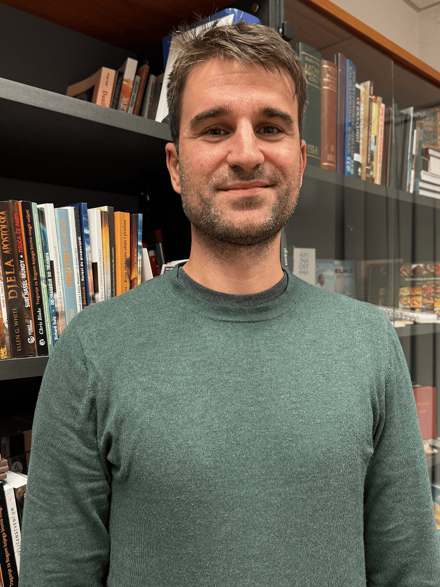

Basketball was Goran’s life.

From the age of 12, he thought about it, dreamed about it, and built his identity around one goal: becoming a professional player. After high school in Croatia, that dream seemed within reach when he received a basketball scholarship to the University of Maine at Fort Kent in the United States.

In northern Maine, Goran studied business management and trained intensely as part of the student-athlete program. But by his senior year, reality set in. He would not make it into the professional leagues.

“With my lifelong dream crushed,” he said, “everything felt pointless.”

He graduated with a Bachelor of Science degree and returned to Croatia, landing a job in tax consulting in Zagreb. Outwardly, he was successful. Inwardly, he was empty.

“I would be in a nightclub,” he recalled, “and suddenly the thought would come: What am I doing here? This life is meaningless, too.”

Goran had grown up in a good family. Around the time he became obsessed with basketball, his mother began studying the Bible with Seventh-day Adventists and was baptized. Occasionally he attended church with her. Before he left for the United States, she gave him a Bible in English.

At university, he sometimes read it, especially Revelation, though he understood little. In difficult moments, he even prayed. But he never felt a personal relationship with God.

Now, back in Croatia and searching for purpose, he decided to try again.

“I told myself, I’ve tried everything else. The only thing left is to go back to the Bible and see about a life with God.”

He began reading and praying earnestly. Wanting to find his own way rather than simply follow his mother’s path, he attended a Sunday-keeping church. But one issue troubled him.

“The thorn in my eye was always the Sabbath,” he said. “From childhood, I knew what the Bible said.”

When his Bible study group reached Exodus 20, he listened carefully. The explanation of the fourth commandment was brief: “Our Sabbath is now Sunday.” Then they moved on.

Goran was not convinced.

One night, pouring out his heart in prayer, he opened to Isaiah 58 and read about calling the Sabbath “a delight.” The words struck him deeply. The conviction became clear.

He decided to visit the Zagreb 1 Seventh-day Adventist Church. He even invited his mother to come with him.

“As soon as I came,” he said, “I felt my heart was at home.”

He was ready for baptism, but one question remained: Ellen G. White.

Around this time, he met Daniela, a young woman at church who would later become his wife. Goran shared his concerns about Ellen White’s prophetic ministry.

“OK,” Daniela told him, “have your opinion. But watch just one video.”

The presentation carefully explained the biblical characteristics of a prophet. It made sense. Goran began reading for himself.

“The more I studied the Bible and her writings,” he said, “the more convinced I became that I was on the right path.”

He was baptized at Zagreb 1. Six months later, he and Daniela were married there.

“I finally found the missing piece,” he said. “I found it in Jesus.”

But the story did not end there.

Wanting others to experience the same joy, Goran and Daniela launched a Facebook outreach called “Giveaway Books.” They offered free copies of _The Great Controversy_, _The Desire of Ages_, and other Christian books—shipping included.

The response was overwhelming. More than 10,000 books have been distributed across Croatia. As interest grew, the Trans-European Division helped expand the project, and similar initiatives began in neighboring countries.

Goran and other young members of Zagreb 1 also adapted their printed Bible studies into an online course called “Bible Truth.” Thousands enrolled. One student, who had nearly abandoned his spiritual journey, is now studying to become a Seventh-day Adventist pastor.

Then, in 2020, a devastating earthquake struck Zagreb. The historic Zagreb 1 sanctuary—home to so many life-changing decisions—was damaged beyond repair and had to be demolished.

“It was heartbreaking,” Goran said. “But when we heard about the Thirteenth Sabbath Offering project, it gave us hope.”

The building may be gone, but the mission continues. The faith of this vibrant congregation remains strong. Through social media, online Bible studies, and personal witness, they are reaching more people than ever.

_Your Thirteenth Sabbath Offering will help rebuild a new sanctuary in the heart of Zagreb: a place where searching hearts like Goran’s can find the missing piece. Thank you for giving generously so others can find their home in Jesus._

```=Story Tips

- Show the location of Croatia on a map.
- Download photos for this story from Facebook: https://bit.ly/fb-mq.
- Share facts related to Croatia (see below)

```

```=Mission Post

- The Seventh-day Adventist message first entered the Balkan Peninsula, where Croatia is located, in 1880, when A. Seefried went to Skoplje in what is now the Republic of Macedonia.
- A branch publishing house was established around 1913 in Zagreb called Zivot i zdravlje (“Life and Health”) and remained active until World War II.
- After Croatia declared independence from Yugoslavia in the early 1990s, the Znaci Vremena (Signs of the Times) publishing branch in Zagreb became the Croation-Slovenian Publishing House, now the Croatian Publishing House.
- Croatia is home to Adriatic Union College and the Adventist Secondary School in Marusevec.

```