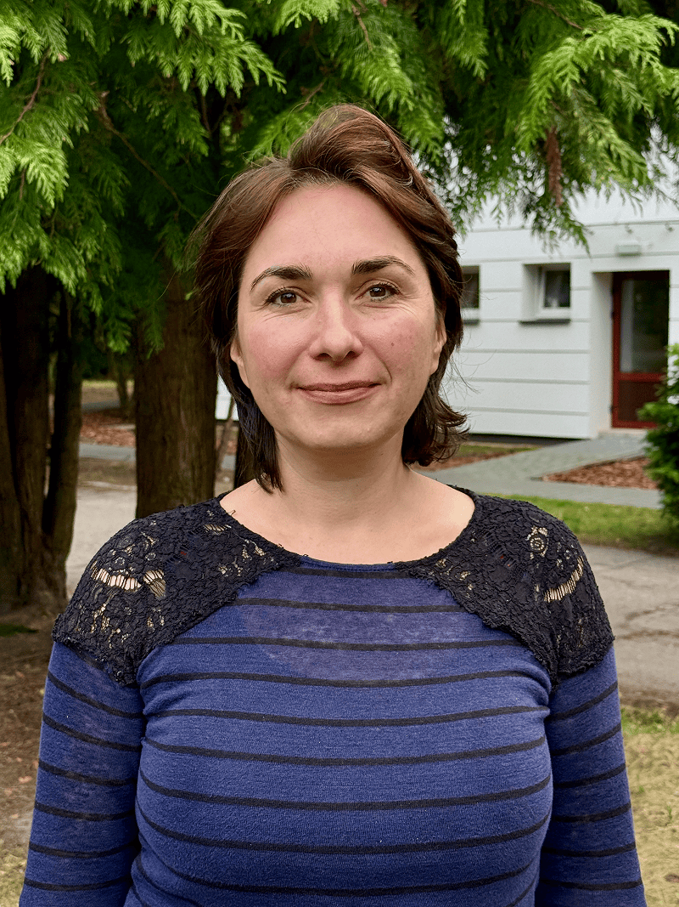

For nearly 20 years, Agata taught Polish language and literature in public schools near Warsaw. She loved teaching, but over time she felt something was missing. Classes were crowded, lessons rushed, and there was little time to truly know students.

“I wanted something deeper,” Agata said. “Not just to teach a lesson and leave, but to really know my students—their needs, their talents, their families.”

By 2018, she knew it was time for a change.

That same year, a small group of Adventist parents began offering English classes for kindergarten-age children on a church campus. What started with a few families became a shared conviction: their children needed an Adventist school shaped by faith, relationships, and purpose.

The parents asked Agata if she would help.

The situation was uncertain. There was one classroom, and funding would last only three months. Accepting the invitation meant leaving a stable teaching position, while carrying a mortgage and relying largely on her husband’s income.

“I prayed a lot,” she recalled. “It was one of the hardest decisions of my life.”

When she asked her husband for advice, his answer was simple: “Just try.”

Agata stepped forward in faith. Three months passed—and then more funding came. “We never had a moment when we didn’t have money,” she said. “God blessed it from the beginning, even though the beginning was very difficult.”

Out of that fragile start grew KOMPAS, an Adventist primary school and preschool serving children from grades 1 through 8. In just a few years, enrollment grew to 50 students in the primary school and 32 in preschool, supported by a team of teachers and staff who see their work as a calling.

Agata is quick to credit the team. “It’s not only a job,” she said. “We see this as a mission field.” Working together, they have shaped a school culture that is intentional and spiritually warm.

As the school developed, so did its philosophy. Adventist education, Agata and her colleagues realize, is not simply adding Bible time to a standard curriculum. It is educating the whole child—physically, emotionally, intellectually, and spiritually.

One key influence was outdoor education. Bible lessons often start indoors and continue in nature, where children connect Scripture with what they see around them—clouds, trees, soil, and sky.

“When children are outside, they are in God’s creation,” Agata said. “They breathe fresh air, they move, their minds work better. And they understand that nature is something God made.”

Montessori-based methods also help teachers meet each child where they are. Younger students work at their own pace with hands-on materials, guided as needed.

Faith at KOMPAS extends beyond the classroom. Students serve their community—visiting elderly neighbors, sharing handmade cards with Bible verses, and singing for people who might otherwise feel alone.

Fridays look different too. Students work in gardens and around the campus—painting, sweeping, raking, collecting wood—and seeds in the soil become lessons about God’s Word. The week often ends with a shared campfire, where preschoolers and older students gather, talk, and play together.

Over time, Agata and her colleagues noticed change in the children themselves.

“The spirit here changes children’s hearts,” she said. “We see it in how they speak to one another, how they think about whether their words will hurt someone. Even first graders show empathy. We know the Holy Spirit is working.”

One rainy day made that especially clear. During a planned outing, the weather turned miserable. As Agata worried aloud, two eight-year-olds—her daughter and a classmate—offered a solution. “Don’t worry,” they said. “We will pray.”

They did. The rain stopped.

“For them, prayer is the first response,” Agata said. “They believe God listens—and they see the results.”

Today, Agata serves as the school’s principal, a role she once resisted because she wanted to remain close to students. Yet the calling is clear.

“This is not just a school,” she often says. “It is a mission field.”

At KOMPAS, children are being shaped to live with Christ-centered compassion wherever they go. “This education is eternal,” Agata reflected. “It begins here, but it continues into heaven.”

Now the school is growing again and space is limited. Plans are underway to add a new level with several classrooms and other needed facilities so more children can learn in this Christ-centered environment. Part of your Thirteenth Sabbath Offering will go to help build this addition to the KOMPAS school.

Agata is confident that just as God led from the beginning, He will continue to lead through prayer, dedicated educators, and the generosity of believers around the world.

```=Story Tips

- Show the location of Poland on a map.
- Download photos for this story from Facebook: https://bit.ly/fb-mq.
- Share facts related to Poland (see below)

```

```=Mission Post

- Poland has 117 Seventh-day Adventist churches, 33 companies, and 6,032 members. With a population of 37,565,000, that is one church member for every 6,228 Poles.
- Poland is one of the most religious countries in Europe, and Catholicism remains an important part of Polish society.
- More than 70 percent of Poles are Catholic, 21 percent claim no affiliation, and 7 percent have no religion. Other Christian denominations only make up 1 percent of the population.
- The first Adventist workers, J. Laubhan and H. Szkubowicz moved to eastern Poland from Crimea. By 1893, the first church in what then was the territory of Poland was established.

```