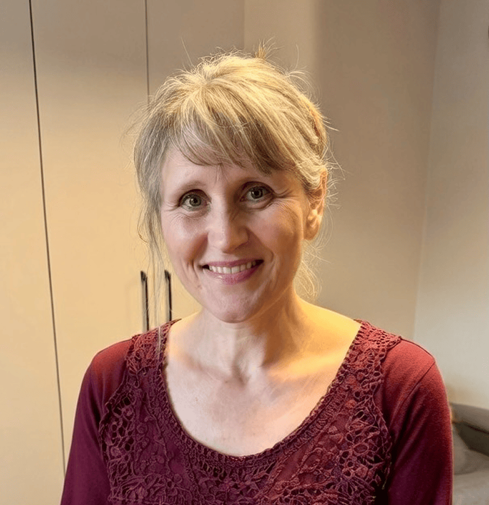

Monika never planned to teach at an Adventist school.

Her journey to the classroom began almost by accident during a conversation at a wedding in 2022. Someone asked if she could teach history at KOMPAS Adventist Primary School. She wasn’t sure, but she did have a deep love for history, experience educating her own children through homeschooling, and years spent learning alongside other families in a small home-education community.

“I knew what was expected in the curriculum,” Monika said. “And I knew how children learn.”

She agreed to try.

Today, Monika teaches history from grades 4 through 8. She is also the main classroom teacher for grades 5 and 6, staying with her students as they move up—a continuity that allows her to know them well. She also teaches some Polish. “We’re growing together,” she said.

Her classroom is anything but typical.

The students come from many backgrounds and belief systems: Adventist, Catholic, Calvinist, atheist, Buddhist, Hare Krishna. Some openly talk about reincarnation. Many have special learning needs. It is a mix that might intimidate some teachers. Monica isn’t worried.

“You just move forward,” she said.

When she first stepped into her role as a main teacher, she recognized an immediate challenge: if Bible time was going to be meaningful, the students first needed to trust the Bible itself. So instead of beginning with familiar stories, she began with questions.

For nearly a month, the class explored why the Bible claims authority and how Scripture describes itself as light, truth, and a living word. Students opened their own Bibles daily, reading passages and comparing what the Bible says about itself.

“We try not to have a day when we don’t open the Bible,” Monika explained. “And we always explain clearly that what we are saying comes from Scripture.”

That approach was shaped by a moment she will never forget.

On the first day of school, as she explained the daily schedule, one boy raised his hand. “Can you believe in God and not in the church?” he asked.

It was not an easy question. Monika went home and thought about it for a long time. Finally, she knew how to answer.

“Yes,” she told him. “I was a person like that for many years.”

That answer opened the door for something deeper.

Monika understands doubt because she lived it. She was raised by an atheist father who openly mocked religion. Loving him, she adopted his views. As a teenager, she believed faith was an illusion—until one quiet evening changed everything.

Sitting alone at her desk one night at age sixteen, she began thinking about the world and how it worked. “It couldn’t have happened by itself,” she realized. In the darkness, she whispered what she now recognizes as her first prayer: _If there is an Almighty Power, show Yourself to me._

That prayer cracked the door open.

God’s answers came slowly—through books, friendships, and unexpected encounters. She bought her first Bible almost casually, placing it untouched on a shelf. Later, through friends exploring faith during Poland’s final years under communism, she began attending meetings, asking questions, and opening Scripture for herself.

Some paths led to dead ends. Others revealed truth mixed with error. But one thing became clear: the Bible could be trusted, and Jesus was real.

Eventually, Monika attended Adventist evangelistic meetings in Warsaw. She learned biblical teachings she had never encountered before. Finally, one June day just after finishing her high school exams, she was baptized.

That journey shaped her life. It also shapes her teaching.

“When students ask hard questions, I’m not afraid,” Monika said. “I’ve been there.”

Today, many of her students have never heard basic Bible stories—stories Adventist children often know by heart. Monika introduces them gently, sometimes using _My Bible Friends_ books, building a shared foundation of Scripture and trust.

In her classroom, faith is never forced. It is offered clearly, consistently, and lovingly.

_Your Thirteenth Sabbath Offering will make a big impact at the KOMPAS school, allowing the school to expand by adding 200 square meters (2,153 square feet). This will give much needed additional space for this growing school. Thank you for helping to support mission!_

```=Story Tips

- Show the location of Poland on a map.
- Download photos for this story from Facebook: https://bit.ly/fb-mq.
- Share facts related to Poland (see below)

```

```=Fast Facts

- The official name of Poland is the Republic of Poland.
- The capital and largest city of Poland is Warsaw.
- The official language of Poland is Polish.
- The Polish currency is the Złoty.
- The name for Poland in Polish is Polska, meaning field or flatland.
- Poland has around 10,000 lakes. The largest are Śniardwy and Mamry, while the deepest is Lake Hańcza at 356 feet (108.5 m) deep.

```