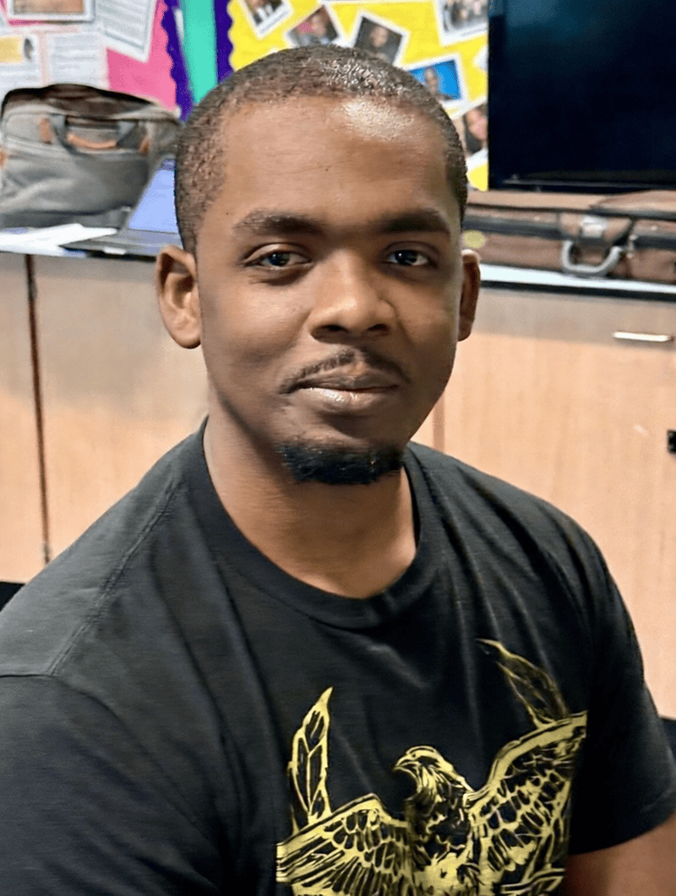

When Kieron first picked up a violin at age four, it wasn’t entirely his idea.

His older brother had already begun lessons, and their mother had one clear rule: “If you’re going to play the violin, play it properly.”

Kieron did.

Born in London, he spent seventeen years growing up in Grenada before returning to the UK in 2019. His mother believed the move would give her sons greater opportunity. “She didn’t want us to hit a glass ceiling,” he said. “She wanted us to experience more.”

Music became that pathway.

By age thirteen, Kieron was already teaching piano and violin. He led rehearsals, coached ensembles, and developed a reputation for discipline and excellence. “I had the highest grade in my group and was the most committed,” he said. Responsibility came naturally.

When he returned to London, he contacted Fiona at the East London School of Classical Music (ELSOM). His brother had studied there years earlier and knew the director well. Kieron called and simply asked if there was a job.

“There was,” he said with a smile. “She needed a theory teacher.”

Music theory, he insists, is essential. “It’s like learning a language. There’s no point speaking French if you can’t read it. Music is the same—you must understand it.”

That understanding has shaped his entire career. Today, at 27, Kieron plays seven instruments: violin, viola, cello, double bass, piano, bass guitar, and clarinet. His strong theoretical foundation allows him to move between them with confidence.

“It’s easy to play music,” he said. “It’s not always easy to understand it.”

At ELSOM, his role has expanded. What began as teaching theory grew into leading the strings section of the orchestra and eventually serving as Assistant Music Director. He plans repertoire, conducts sectionals, steps in to conduct when needed, and mentors young musicians.

About 75 students study under his guidance. The string section alone includes more than 20 players.

But for Kieron, music is never just about notes.

“I’ve had students who wouldn’t speak at all when they first came,” he said. “Now they’re confident and expressive. It’s not just about music—it’s about the relationship.”

Music, he believes, reveals character.

“If a child is timid, you hear it in their playing. If they’re careless, you hear it. If they’re diligent, you hear that too. Music amplifies personality—you can’t hide from it.”

That honesty shaped him as well. As a child, frustration sometimes led him to hit the piano when he made mistakes. His mother would calmly tell him to “put water in your wine”—to dilute his intensity and learn patience.

Music became a mirror.

“When you’re struggling with a passage, you have to ask: Is it the music—or is it me?” he reflected. “Sometimes it’s just your personality.”

Over the years, he has watched former students perform at venues like the Royal Albert Hall in London and respond to calls for professional recording sessions. Seeing their growth gives him deep satisfaction.

“Legacy matters,” he said. “It’s a way of saying I was here. I left something behind.”

His faith is woven into his music. Favorite hymns include “Come Thou Fount,” “It Is Well,” and “Great Is Thy Faithfulness.” He believes sacred music shapes the heart as much as technique shapes the hands.

Music, he says, forces you to feel what you might otherwise avoid. Even struggle has beauty. “The intrinsic reward outweighs the suffering,” he said. “And sometimes the suffering itself becomes art.”

At ELSOM, he sees more than scales and sonatas. He sees confidence forming, discipline developing, faith strengthening.

“It’s not just about learning an instrument,” he said. “It’s about becoming someone.”

_Seventh-day Adventists are touching the lives of children and young people in a powerful way across the United Kingdom. This Thirteenth Sabbath, you can help children in England who may not be able to attend a school like ELSOM but need someone to care about them. This quarter’s offering will help the Seventh-day Adventist Church in the UK to create small centers, “Safe Space2Be” for children in community schools across England who may feel worried, lonely, or afraid. These mental health hubs will provide counseling and other supportive services for at-risk children and their families. Thank you for your support._

```=Story Tips

- Show the location of the United Kingdom on a map.
- Download photos for this story from Facebook: https://bit.ly/fb-mq.
- Share facts related to the United Kingdom (see below)

```

```=Fast Facts

- The United Kingdom of Great Britain and Northern Ireland is usually known as the United Kingdom (UK) or simply Britain.
- Although the terms are often used interchangeably, the UK is a political entity; Great Britain refers to the territory of the island containing England, Scotland, and Wales; and the British Isles includes the islands of Great Britain, Ireland, and the many smaller surrounding islands.
- The capital of the UK is London, in England.
- The currency of the UK is the Pound sterling, meaning it is based on sterling silver, rather than gold.
- In 1884, the Royal Greenwich Observatory in London was chosen as the prime meridian, dividing the world into the East and West Hemispheres.
- The first postage stamp in the world was issued in the UK in 1840.
- London has the oldest subway system, opened in 1863.

```