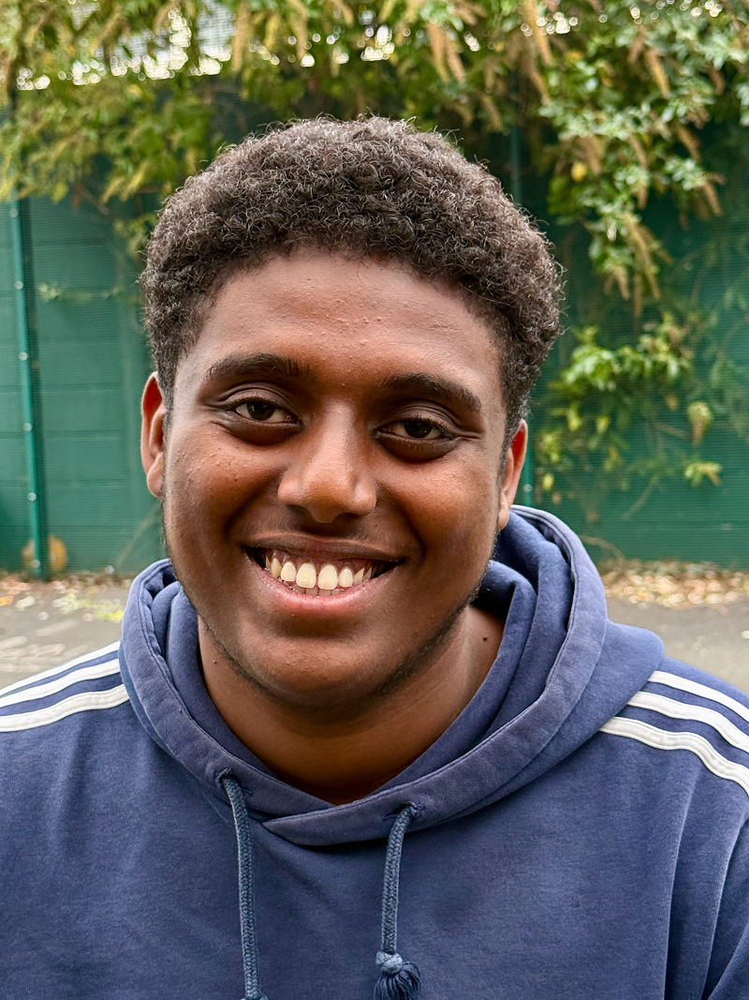
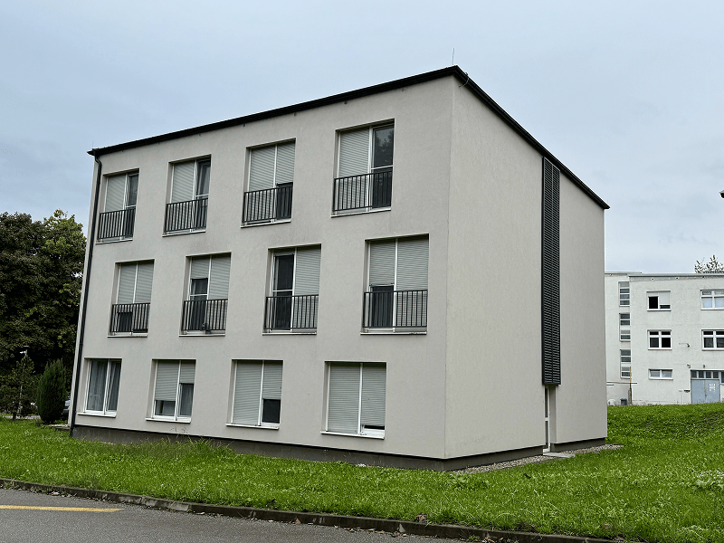
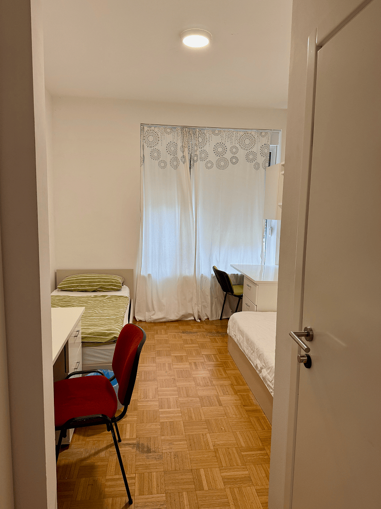

When Yeron first joined the East London School of Classical Music (ELSOM) nearly seven years ago, he simply wanted to learn the violin. He did not realize that the discipline of music would shape not only his skill but his faith.

He began with violin. Last year he added trumpet. Alongside performance, he studies music theory, learning to calculate rhythms, analyze musical passages, and understand structure and harmony.

“Sometimes, we face challenges,” he said thoughtfully. “Even when you know the theory, you still have to apply it.”

That lesson, he admits, applies far beyond music.

Now a university student studying business at London Metropolitan University, Yeron continues to serve faithfully at his home church in Tottenham. His brother plays the piano. Yeron plays the violin. Together they regularly lead music for worship services.

“We dedicated ourselves in the church to serve God,” he said simply.

Growing up in a Christian home, music was never merely entertainment. His mother, who once sang as a young woman in Ethiopia, insists on discipline and commitment. His father loves hymns, especially those that point to Christ’s return. On Friday evenings, the family gathers for worship—singing, praying, and playing together.

Those habits formed something steady inside him.

ELSOM gave Yeron opportunities he never expected. He has performed in churches across London, participated in orchestra concerts in the heart of London, and even played before HRH The Duchess of Gloucester during the school’s tenth anniversary celebrations.

“It was a big moment,” he said. “But the best part is that the songs we play always praise the Lord.”

His violin teacher carefully selects repertoire that reflects Christian values. Christmas programs are filled with hymns celebrating Christ’s birth. Sacred music is not an afterthought—it is central.

“It has greatly impacted my faith positively for the Lord,” Yeron said. “There’s no way we can perform songs that don’t reflect God.”

Performance exams, however, can be intimidating. External Trinity College examiners assess each student. Standards are high, and distinctions are expected.

“It’s scary at first,” he admitted, “but over time it gets easier.”

Through music, Yeron has learned perseverance; through public performance, confidence; through sacred repertoire, spiritual commitment.

He has also seen how music shapes character. Discipline in practice spills into discipline in life. Attention to detail builds responsibility. Working within an orchestra teaches cooperation and humility.

“In music, you can’t hide,” he explained. “You have to do your part well so everyone else can succeed.”

In a city as large and busy as London, where distractions and pressures are constant, ELSOM has provided something steady and purposeful: a community grounded in excellence and faith.

Today, Yeron sees music not just as a skill, but as ministry.

“I just think ELSOM is amazing,” he said. “You learn a lot. The teachers help us through difficulties. And we use what we learn to serve God.”

His dedication to excellence, to discipline, and above all to Christ, continues to grow.

Young people like Yeron are strengthened when faith and community work together.

_This Thirteenth Sabbath, you can help children in England who may not be able to attend a school like ELSOM but need someone to care about them. This quarter’s offering will help to create a SafeSpace2Be for children in community schools who may feel worried, lonely, or afraid. The offering will also go to three other projects in the Trans-European Division, including: A family Misson Center OIKOS church plant in Helsinki, Finland; expansion of KOMPAS, the first Adventist Primary School in Poland; and rebuilding the Seventh-day Adventist Church building in Zagreb, Croatia, Thank you for giving generously to the Thirteenth Sabbath offering this Sabbath!_






Thank you for your generous support of the Thirteenth Sabbath Offering. In the first quarter of 2017, these funds helped provide a much-needed men’s dormitory at the Seventh- day Adventist secondary school in Maruševec, about 80 minutes north of Zagreb, Croatia. This quarter, your offerings will help rebuild the Prilaz Seventh-day Adventist Church in Zagreb. Thank you for faithfully supporting your brothers and sisters in Croatia through your giving.

```=Story Tips

- Show the location of the United Kingdom on a map.
- Download photos for this story from Facebook: https://bit.ly/fb-mq.
- Share facts related to the United Kingdom (see below)

```

```=Mission Post

- The British Union Conference was organized in 1903, with a membership of 1,160.
- There are seven Adventist schools in Britain: Newbold College of Higher Education, Stanborough Park Secondary School, Stanborough Park Primary School, Newbold School, Hyland House School, Harper Bell School, and Flete Wood School.

```

```=Fast Facts

- The official language of the UK is English, although there are recognized regional languages, including Scots, Ulster Scots, Scottish Gaelic, Welsh, Cornish, and Irish.
- The Kingdom of Great Britain was formed by the Acts of Union in 1707 when the Kingdoms of England and Scotland united.
- In 1800, another Act of Union united Great Britain with the Kingdom of Ireland. Although most of the island of Ireland has become an independent country, the northern part of the country remains part of the United Kingdom.
- The water separating the UK from the rest of Europe is known as the English Channel, while the water between Ireland and the rest of Britain is called the Irish Sea.

```

```=Before 13th Sabbath

- Remind everyone that our mission offerings are gifts to spread God’s Word around the world and that one-fourth of our Thirteenth Sabbath Offering, also known as the Quarterly Mission Project Offering, will help four projects in the Trans-European Division. The projects are listed on page three and on the back cover.
- The narrator doesn’t need to memorize the story, but he or she should be familiar with it.
- Before or after the story, use a map to show the places in the Trans-European Division—Finland, Poland, Croatia, and the United Kingdom—that will receive the Thirteenth Sabbath Offering.

```

```=Next Quarter’s Mission Projects

The West-Central Africa Division will be featured next quarter, and the special projects will include:

- Establishing a Center of Influence at the Prince Emmanuel International Academy in Abidjan, Côte d’Ivoire (Ivory Coast).
- Providing a Health Clinic in Praia, Cabo Verde
- Building the Prince Emmanuel Children’s School in Bata, Equatorial Guinea

```